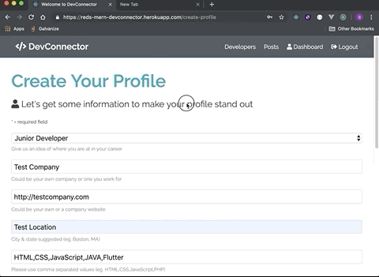
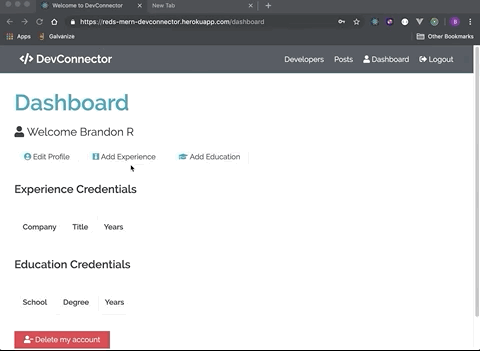

# MERN-DevConnector
This is a full stack social network application with profile creation, posting, commenting, and liking functionality.

Feel free to create an account to test the functionality of the site.
[Deployed Site](https://reds-mern-devconnector.herokuapp.com/)

## Primary Technologies Used
* React.js
* Redux
* node.js
* express.js
* MongoDB
* bcrypt
* JSONWebToken

## Demo

### The Landing page
This page is a basic layout for signing up or logging in to the site. From this page the user can navigate to current developer profiles, registration, and login pages. Navigation for the entire site is done through React Router.

### Create-Profile Dashboard
Here is where the newly registered user will set up their basic profile information.

After the user inputs their profile info. They will be directed to the user dashboard with the ability to add Education and Work Experience.

