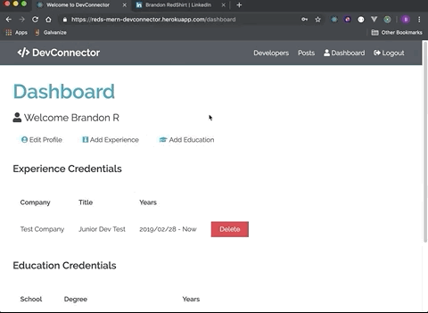

# MERN-DevConnector
This is a full stack social network application with profile creation, posting, commenting, and liking functionality.

Feel free to create an account to test the functionality of the site.
[Deployed Site](https://reds-mern-devconnector.herokuapp.com/)

## Primary Technologies Used
* React.js
* Redux
* node.js
* express.js
* MongoDB
* bcrypt
* JSONWebToken

## Demo

### The Landing Page
This page is a basic layout for signing up or logging in to the site. From this page the user can navigate to current developer profiles, registration, and login pages. Navigation for the entire site is done through React Router.

### Create-Profile Dashboard
Here is where the newly registered user will set up their basic profile information.

After the user inputs their profile info. They will be directed to the user dashboard with the ability to add Education and Work Experience.

Completed Profile Dashboard:

### User Profiles View
Once the user has completed their profile setup they can see how it looks by going to the developers link and finding their profile. The individual profile page will show the basic information input into the create-profile page, the users avatar which is pulled from Gravatar, as well as five of the users most recent Github repos.

### User Posts
This is where the user can make a post. Also, from here the user can like, unlike, and comment on other users posts.

##Thank You!
Hopefully you enjoyed this! Happy coding!
